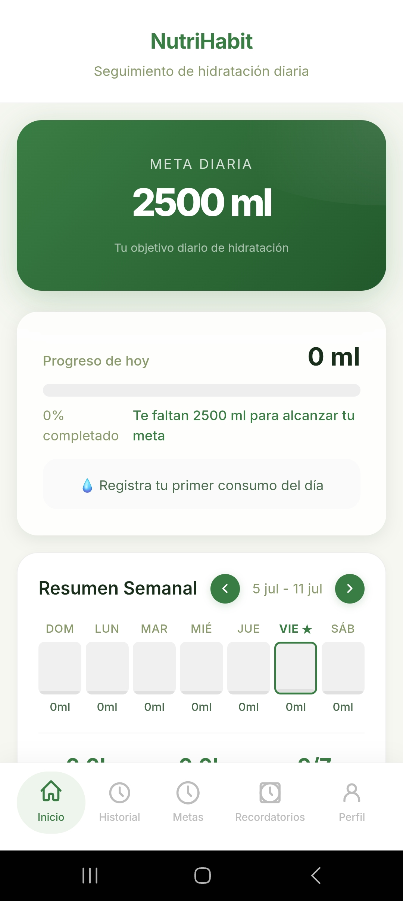
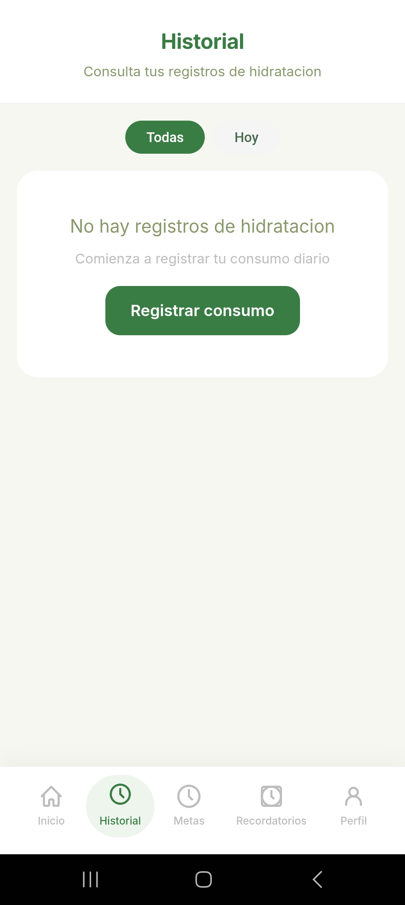
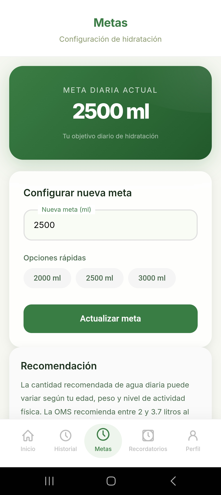
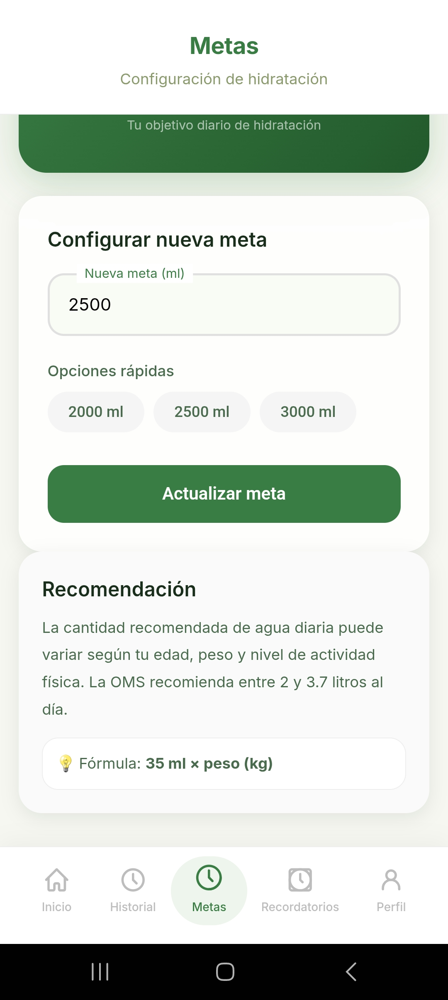
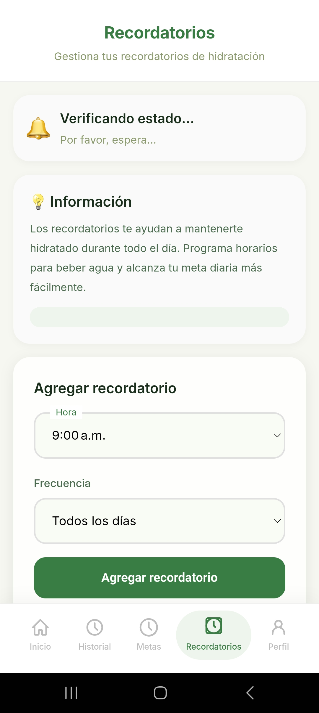
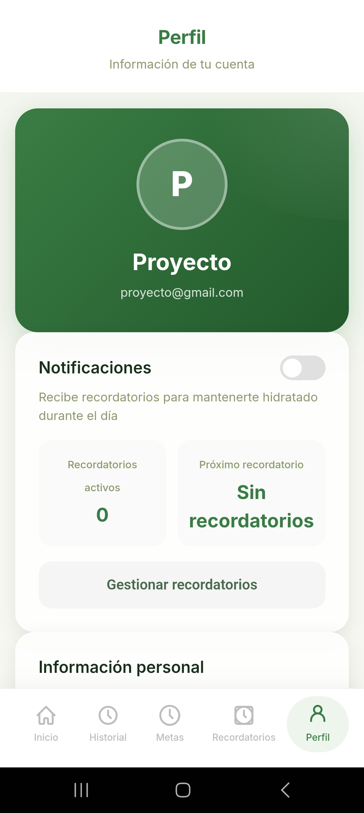
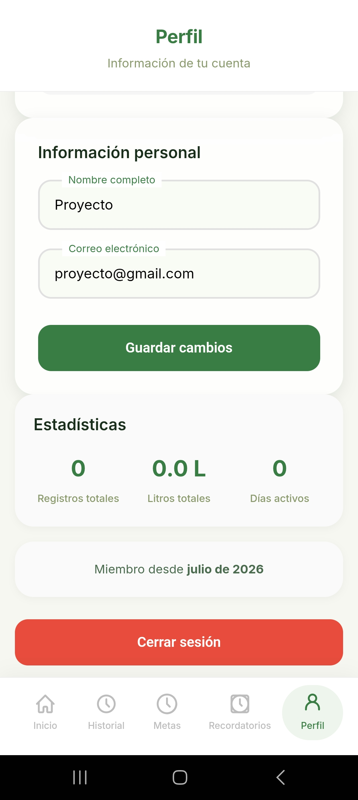

# NutriHabit - Hidratacion Diaria

<div align="center">

**Pequenos habitos, grandes cambios**


</div>

---

## Descripcion

**NutriHabit** es una aplicacion movil Android disenada para ayudar a los usuarios a desarrollar habitos de hidratacion saludables. Permite registrar el consumo diario de agua, establecer metas personalizadas, visualizar estadisticas de progreso y recibir recordatorios push nativos.

---

## Capturas de Pantalla

| Dashboard | Registrar Consumo | Historial | Recordatorios |
|:---------:|:-----------------:|:---------:|:-------------:|
|  |  |  |  |

| Metas | Perfil | Configuracion |
|:-----:|:------:|:-------------:|
|  |  |  |

---

## Funcionalidades

| Modulo | Descripcion |
|--------|-------------|
| **Autenticacion** | Registro e inicio de sesion con Firebase Authentication (email/password) |
| **Dashboard** | Progreso diario con barra visual, meta, y resumen semanal con grafica de barras |
| **Registrar consumo** | Formulario con cantidades rapidas (250/500/750/1000 ml) y notas opcionales |
| **Historial** | Lista de registros con filtros (hoy/todas), editar y eliminar |
| **Metas** | Configuracion de meta diaria (500-10,000 ml) |
| **Recordatorios** | Alarmas nativas Android con frecuencia diaria, lunes-viernes o fines de semana |
| **Perfil** | Edicion de datos, estadisticas, toggle de notificaciones |
| **Notificaciones** | Push nativas via Capacitor Local Notifications (Android) y Service Worker (Web) |

---

## Arquitectura

```
MVVM (Model - View - ViewModel)
```

| Capa | Componentes | Responsabilidad |
|------|------------|-----------------|
| **Vista** | 9 pantallas HTML/CSS | Interfaz de usuario |
| **ViewModel** | 7 ViewModels JS | Logica de negocio y estado |
| **Repositorio** | 4 Repositorios | Abstraccion de acceso a datos |
| **Servicio** | Firebase + Notificaciones | Conexion a backend y sistema |
| **Modelo** | 4 Modelos (Usuario, RegistroAgua, Meta, Recordatorio) | Estructura de datos |

---

## Modelo de Datos (Firestore)

```
usuarios
   |-- uid: string
   |-- nombre: string
   |-- correo: string
   |-- metaDiaria: number (default: 2500)
   |-- notificacionesActivas: boolean
   +-- fechaRegistro: timestamp

registro_hidratacion
   |-- idUsuario: string
   |-- cantidadML: number
   |-- fecha: string (YYYY-MM-DD)
   |-- hora: string (HH:MM)
   |-- nota: string
   +-- editado: boolean

recordatorios
   |-- idUsuario: string
   |-- hora: string (HH:MM)
   |-- frecuencia: string
   |-- activo: boolean
   +-- fechaCreacion: timestamp
```

---

## Tecnologias

| Categoria | Tecnologia | Version |
|-----------|-----------|---------|
| Frontend | HTML5, CSS3, JavaScript (ES Modules) | - |
| Framework Nativo | Capacitor | 8.x |
| Backend | Firebase Authentication + Cloud Firestore | 10.8.0 |
| Notificaciones | Capacitor Local Notifications | 8.2.0 |
| Diseno | CSS Custom Properties, Glassmorphism | - |
| Fuente | Inter (Google Fonts) | 400-800 |

---

## Estructura del Proyecto

```
NutriHabit-App/
|-- www/                              # Codigo fuente web
|   |-- css/style.css                 # Sistema de diseno
|   |-- ui/                           # 9 pantallas HTML
|   |   |-- acceso/                   # Login, registro
|   |   |-- inicio/                   # Dashboard principal
|   |   |-- hidratacion/              # Registro de consumo
|   |   |-- historial/                # Historial de registros
|   |   |-- metas/                    # Configuracion de metas
|   |   |-- recordatorios/            # Gestion de alarmas
|   |   +-- profile/                  # Perfil de usuario
|   |-- vistaModelo/                  # 7 ViewModels
|   |-- modelos/                      # 4 Modelos de datos
|   |-- repositorios/                 # 4 Repositorios
|   |-- servicios/                    # Firebase + Notificaciones
|   +-- utilidades/                   # Helpers y utilidades
|-- codigo-fuente/                    # Proyecto Capacitor
|   |-- android/                      # Proyecto Android
|   |-- www/                          # Codigo fuente (copia)
|   |-- capacitor.config.json
|   +-- package.json
|-- docs/                             # Documentacion del proyecto
|   |-- bitacora/                     # Bitacoras semanales
|   |-- arquitectura/                 # Documentacion de arquitectura
|   |-- diagramas/                    # DER y mapa de navegacion
|   |-- evidencias/                   # Capturas de pantalla
|   |-- backlog/                      # Backlog ajustado
|   +-- RESUMEN-PROYECTO.md          # Resumen tecnico
|-- documentacion-final/          # Documentacion final del proyecto
|   |-- imagenes/                     # Capturas nuevas de la app
|   |-- prototipo/                    # APK final
|   |-- Documentacion tecnica- proyecto final.pdf
|   |-- Manual de usuario - trabajo final.pdf
|   +-- Manual de usuario - trabajo final.pdf.docx
|-- prototipo/                        # Prototipos
|   |-- prototipo semana 4/          # Prototipo navegable
|   +-- prototipo semana 5/          # APK funcional
+-- README.md
```

---

## Como Ejecutar

### Requisitos
- Node.js 18+
- Android Studio
- Dispositivo Android o emulador

### Instalacion
```bash
# Clonar repositorio
git clone https://github.com/dianni041004-droid/nutrihabit-hidratacion-diaria.git

# Entrar al directorio de codigo fuente
cd codigo-fuente

# Instalar dependencias
npm install

# Sincronizar con Android
npx cap sync android

# Abrir en Android Studio
npx cap open android
```

### Build APK
```bash
# En Android Studio: Build > Build Bundle(s) / APK(s) > Build APK(s)
# O desde terminal:
cd android && ./gradlew assembleDebug
```

---

## Integrante

**Dianni Paredes Tavarez**
- Universidad Abierta para Adultos (UAPA)
- Seminario de Proyecto II - 2026

---

## Documentacion Adicional

- [Resumen del Proyecto](docs/RESUMEN-PROYECTO.md) - Ficha tecnica completa
- [Bitacora Semana 4](docs/%20bitacora/bitacora-semana4.md)
- [Bitacora Semana 5](docs/%20bitacora/bitacora-semana5.md)
- [Arquitectura Documentada](docs/arquitectura/ARQUITECTURA%20DOCUMENTADA.pdf)
- [Diagrama Entidad-Relacion](docs/diagramas/DIAGRAMA%20ENTIDAD-RELACI%C3%93N.png)
- [Mapa de Navegacion](docs/diagramas/Mapa%20de%20navegaci%C3%B3n%20(B.2).png)
- [Backlog Ajustado](docs/backlog/BACKLOG%20AJUSTADO.pdf)
- [Documentacion Tecnica Final](documentacion-final/Documentacion%20tecnica-%20proyecto%20final.pdf)
- [Manual de Usuario Final](documentacion-final/Manual%20de%20usuario%20-%20trabajo%20final.pdf)
